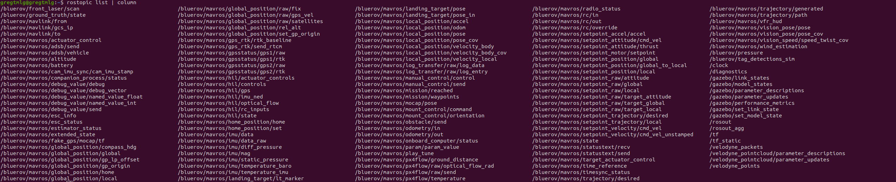
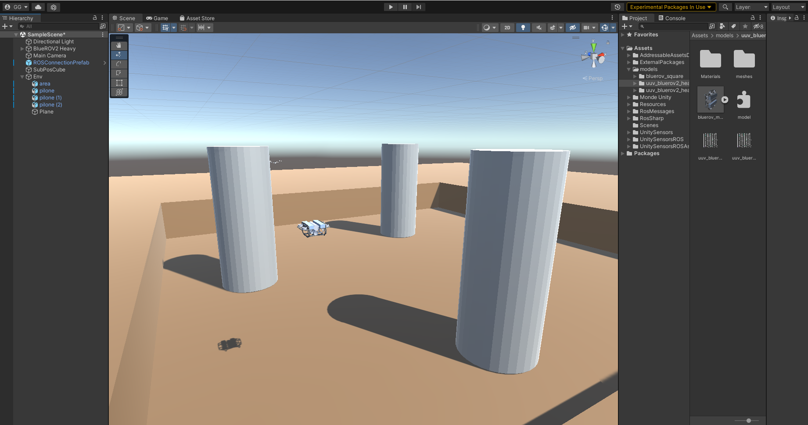
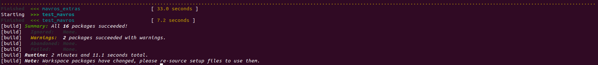
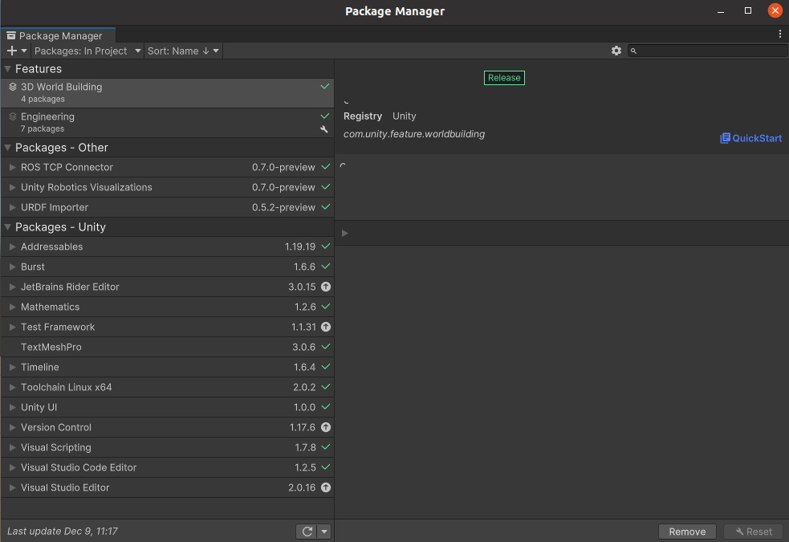

# Application DRL au Bluerov_2 ROS/Unity

L'objectif est de pouvoir intégré un algorithme de Deep Reinforcement Learning au BlueRov2.
Le Bluerov2 est ici contrôlé via ROS Noetic, qui permet d'utiliser le package Mavros qui fait le lien avec PX4. Unity est pour le moment utilisé seulement pour la visualisation. Le DRL est construit à partir des librairies gym et stable-baselines3.

Ce projet est en cours de construction, le code n'est pas propre.

## Prérequis

- Ubuntu 20.04.5 LTS
- Python 3.8
- Unity 2021.3.13f1

## Structure

Le projet est divisé en 2 parties distinctes : une partie concernant ROS et le DRL, et une seconde concernant la visualisation avec Unity.

- ### ROS-DRL

La partie Ros-DRL nous sert au lancement de la simulation, à la gestion des messages ainsi qu'au contrôle du BlueRov2. Dans cette partie on retrouve notamment les fichiers de launch ros, les noeuds python gérant le contrôle du BlueRov2 (keyboard ou DRL). C'est aussi dans cette partie que l'on installe le logiciel de contrôle PX4.

ROS est un opérateur système robot qui nous permet de pouvoir développer notre application DRL de manière libre. Via MAVROS (et MAVLINK) notre application envoie les commandes que le drone doit exécuter et reçoit les données de "vol" via les topics ROS :

- ### Unity

Unity est un moteur de jeux vidéos très répandu. Il est très puissant et intéressant pour nous puisqu'il offre la possibilité de communiquer avec ROS en ajoutant un simple package au projet. 
Unity nous permet dans ce projet de créer/recréer l'environnement que l'on souhaite de manière la plus réaliste possible et d'y faire évoluer le Bluerov2 :

## Installations

### Environnement de développement

Pour travailler sur le projet, j'utilise Visual Studio Code. C'est un IDE simple qui permet de travailler sur plusieurs langages de programmation (ici on utilise essentiellement python), et offre de nombreuses extensions pour reproduire des environnements de travail. 
Pour installer Visual studio code sur Ubuntu, 2 solutions :

1. utiliser Ubuntu Software, rechercher "code" et lancer l'installation

2. télécharger le .deb à cette adresse : https://code.visualstudio.com/download et rentrer la commande suivante dans un terminal 

        sudo apt install ./<file>.deb

Une fois l'IDE lancé, aller dans **Extensions** et installer les extensions **Python** et **Git**

### Installation de ROS Noetic

- Ajout de packages.ros.org à la liste des sources

        sudo sh -c 'echo "deb http://packages.ros.org/ros/ubuntu $(lsb_release -sc) main" > /etc/apt/sources.list.d/ros-latest.list'

        sudo apt install curl 

        curl -s https://raw.githubusercontent.com/ros/rosdistro/master/ros.asc | sudo apt-key add -

- Installation du package complet ROS Noetic

        sudo apt update
        sudo apt install ros-noetic-desktop-full

- Automatisation des sources 

        source /opt/ros/noetic/setup.bash

        echo "source /opt/ros/noetic/setup.bash" >> ~/.bashrc

        source ~/.bashrc

- Dépendences python3/ROS

        sudo apt install python3-rosdep python3-rosinstall python3-rosinstall-generator python3-wstool build-essential

        sudo apt install python3-catkin-tools python3-osrf-pycommon

- Initialisation de rosdep

        sudo rosdep init

        rosdep update

- En cas de problème, suivre les instructions de la doc officielle de ROS : http://wiki.ros.org/noetic/Installation/Ubuntu

### Installation du répertoire DRL-ROS

Pour cette installation, on rassemble tous les packages qui nous sont utiles pour le bon fonctionnement du projet, notamment ROS TCP Endpoint pour pourvoir communiquer avec unity, et le package velodyne, qui simule et gère les messages du capteur.

- On clone tout d'abord le répertoire principal : 

        git clone https://github.com/Gregtmlg/Bluerov2_DRL.git

- On récupére le package ROS TCP Endpoint et on le met dans src : 

        cd Bluerov2_DRL/catkin_ws/src

        git clone https://github.com/Unity-Technologies/ROS-TCP-Endpoint.git

- Le package velodyne auquel on va ajouter un fichier: 

        git clone https://github.com/ros-drivers/velodyne.git

        cd velodyne/velodyne_pointcloud/launch

        nano velodyne.launch

- et coller ce qui suit : 

        <launch>
        <arg name="calibration" default="$(find velodyne_pointcloud)/params/VLP16db.yaml" />
        <arg name="manager" default="velodyne_pointcloud" />
        <arg name="max_range" default="100.0" />
        <arg name="min_range" default="0.1" />
        <arg name="frame_id" default="velodyne" />

        <node pkg="velodyne_pointcloud" type="transform_node" name="$(arg manager)">
        <param name="model" value="VLP16"/>
        <param name="calibration" value="$(arg calibration)"/>
        <param name="max_range" value="$(arg max_range)"/>
        <param name="min_range" value="$(arg min_range)"/>
        <param name="frame_id" value="$(arg frame_id)"/>
        <!-- <param name="view_direction" value="0"/> -->
        <!-- <param name="view_width" value="360"/> -->
        </node>
        </launch>

- Enregistrer et quitter nano.

- Nous allons résoudre les dépendances du projet avec notamment rosdep (rendez vous dans catkin_ws): 

        cd ~/Bluerov2_DRL/catkin_ws

        rosdep install --from-paths src --ignore-src -r -y

        sudo ./src/mavros/mavros/scripts/install_geographiclib_datasets.sh
        
        sudo apt install xmlstarlet python3-pip

        sudo apt install libignition-rendering3

- Maintenant que nous avons tous les packages nécessaires, nous allons pouvoir "build" le répertoire 

        catkin build

- Des warnings peuvent être relevés, mais si toutes les tâches ont bien été exécutées, vous obtiendrez ceci : 

- Ensuite on met à jour les variables d'environnement : 

        echo 'source $HOME/Bluerov2_DRL/catkin_ws/devel/setup.bash' >> ~/.bashrc

        source ~/.bashrc

- On va maintenant ajouter le système de pilotage PX4.

        cd ~/Bluerov2_DRL

        git clone --recursive https://github.com/FormulasAndVehicles/PX4-Autopilot.git

        cd PX4-Autopilot

        bash ./Tools/setup/ubuntu.sh --no-nuttx

        DONT_RUN=1 make -j1 px4_sitl gazebo_uuv_bluerov2_heavy

- Il se peut que lors de l'exécutuion de la dernière commande, la commande make échoue, il faut donc exécuter cette commande encore : 

        sudo apt install libignition-rendering3

- Puis relancer (plusieurs fois si besoin):

        DONT_RUN=1 make -j1 px4_sitl gazebo_uuv_bluerov2_heavy

- Si après plusieurs exécution la commande échoue toujours, recommencez l'installation de PX4 du début, et remplacez la dernière commande par celle-ci : 

        DONT_RUN=1 make -j2 px4_sitl gazebo_uuv_bluerov2_heavy

- Enfin on met à jour les variables d'environnement : 

        echo "source $(pwd)/PX4-Autopilot/Tools/setup_gazebo.bash $(pwd)/PX4-Autopilot $(pwd)/PX4-Autopilot/build/px4_sitl_default > /dev/null" >> ~/.bashrc

        echo "export ROS_PACKAGE_PATH=\$ROS_PACKAGE_PATH:$(pwd)/PX4-Autopilot" >> ~/.bashrc

        echo "export ROS_PACKAGE_PATH=\$ROS_PACKAGE_PATH:$(pwd)/PX4-Autopilot/Tools/sitl_gazebo" >> ~/.bashrc

        source ~/.bashrc

### Installation de la partie Unity

Cette partie implique au préalable d'avoir installer la version 2021.3.13f1 de Unitu via le UnityHub : https://docs.unity3d.com/hub/manual/InstallHub.html?_ga=2.126051912.478744094.1670579681-1092834131.1669643500#install-hub-linux

- On récupère le projet sur GitHub (attention à ne pas cloner ce répertoire dans le précédent Bluerov2_DRL): 

        git clone https://github.com/Gregtmlg/Bluerov2_Unity.git

- Lancer UnityHub, et ouvrir le projet Bluerov2_Unity avec le bon éditeur. 

- Si tout s'est bien passé, voilà ce qui doit s'afficher : 

- Il faut vérifier que tous les packages Unity qui nous sont utiles sont bien installés. Pour cela, on va dans **Window > Package Manager** et cette fenêtre devrait s'ouvrir : 

- Dans la liste des packages du projet, vérifiez bien que ces trois packages sont bien présents : **Burst**, **Addressables** et **ROS TCP Connector**; Si ça n'est pas le cas, ajoutez les. **ROS TCP Connector** est très important ici car il permet la connexion avec ROS. **Burst** et **Addressables** sont essentiels pour faire fonctionner le capteur. 

## Guide d'utilisation

- Dans un premier terminal, lancer le TCP Endpoint avec la commande suivante : 

        roslaunch ros_tcp_endpoint endpoint.launch

- Dans un deuxième terminal, lancer la réception des données capteur : 

        roslaunch velodyne_pointcloud velodyne.launch

- Pour utiliser le robot en mode contrôle clavier, lancer la commande suivante : 

        roslaunch bluerov_sim keyboard.launch

- Sinon, pour lancer l'apprentissage de Deep Reinforcement Learning, lancer le script python stable_baselines_td3.py (soit via un IDE, soit via la commande suivante dans un 3éme terminal) : 

        python3 ~/Bluerov2_DRL/catkin_ws/TD3_VJET/stable_baselines_td3.py

- Pendant que la simulation s'initialise, lancer la visusalisation Unity en appuyant sur la bouton "play" (en haut au centre).

- Pour visualiser le nuage de points du capteur, lancer rviz (sur un autre terminal encore): 

        rosrun rviz rviz

- Dans rviz ajouter le velodyne avec **Add > By topics** 

- Pour voir les topics ROS publiés :

        rostopic list

- Pour lire les messages passant par un topic : 

        rostopic echo /<topic_voulu>

- Enfin pour mettre fin à la simulation, ou en cas de bug : 

        killall -9 rosout roslaunch rosmaster gzserver nodelet robot_state_publisher gzclient python python3 roscore